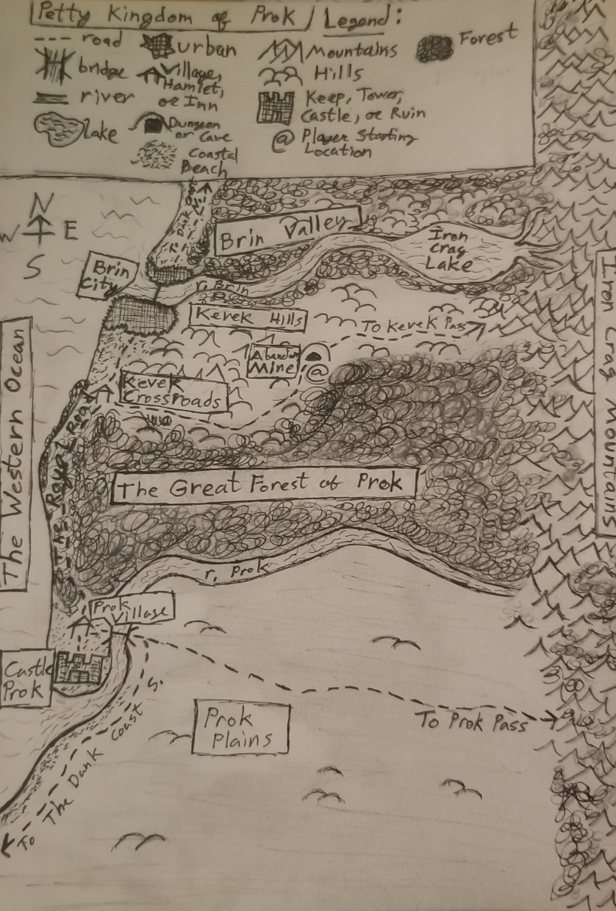

# Sam's Text Adventure

**Description**: I have decided to make a text adventure. Like my previous attempt at doing so, this will be somewhere between a MUD and a Roguelike and a traditional text adventure, mostly with a loose DnD flavor to it.

**Status**: Just getting started. Mostly doing engine prep.

**Rules and Mechanics**:
* Will use a loosely D20-inspired system that I will come up with as the game evolves.
* Will be a text adventure in terms of controls, but also with graphical features (such as printing maps to files or viewing them in the terminal) to be implemented as the game evolves.
* The world will be a graph of regions, each of which is a graph of scenes. There won't be any underlying grid, and none of the areas will be to scale. Ranged combat and melee combat are differentiated by an "engaged" step which an attacker must take to begin melee combat with a defender. Down the road I will implement some grid-based regions to play with some Roguelike concepts.
* Will be a mostly procedurally generated world, but within constraints and with the goal of achieving areas that feel hand crafted. 
* Will be a traditional fantasy world. I will make it up as I go along, starting with an unfleshed-out generic fantasy region and sculpting depth from it as it evolves.
* I will start with only humans being playable and without classes, but I will add all sorts of fantasy races and classes as the game evolves, as well as basically every other feature of every other RPG I have ever played that I feel like implementing. It could get quite extensive.
* more to be determined

## **World Map:**

**Petty Kingdom of Prok**: The Petty Kingdom of Prok is a coastal fiefdom in a large world that has mostly not been envisioned yet. The player begins the game abducted by Goblins in an abandoned mine in the Kevek Hills (I like the Elder Scrolls way of starting an RPG quite a lot). From there they can go south towards Castle Prok (a quest hub with a small procedurally generated town) or north towards the City of Brin (a quest hub and large procedurally generated city), or towards several other areas to be explored. It is a temperate region with mountains to the east, the ocean to the west, plains to the south, and lush valleys to the north, with an enormous and largely untamed forest in the middle. Only the far western edge of the Great Forest of Prok is tamed by the local authorities, and The Royal Road links the City of Brin with Castle Prok, on either side of its expanse. Brin is the only large city in the kingdom, and most of its wilderness is home to bandit camps, unexplored caves and ruins, magical and non-magical wildlife, and more. The Petty Kingdom of Prok is a fairly civilized place, with reasonable people and fair laws prevailing except in the bandit camps and dungeons out in the wilderness. And even in some of the bandit camps and dungeons, the player may find allies instead of enemies. 

*other areas to come*

